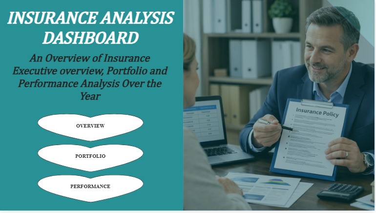
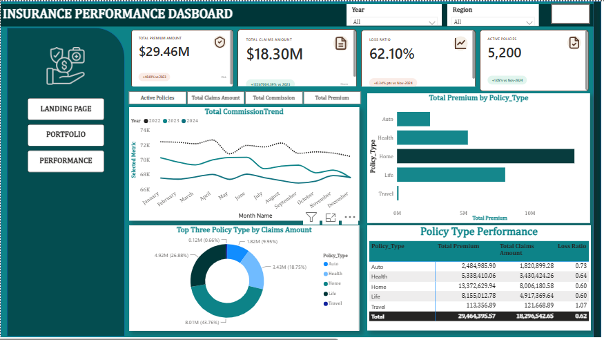
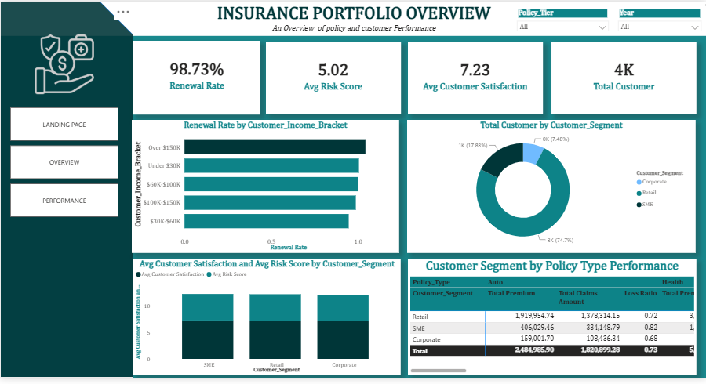
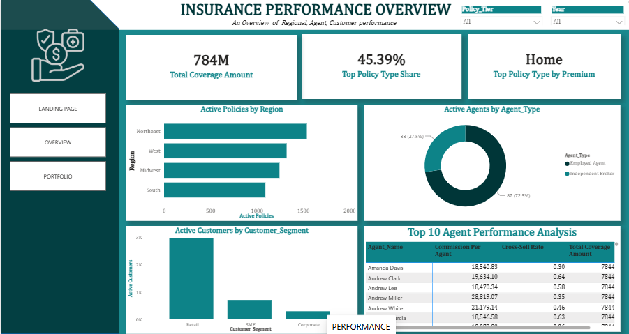

# INSURANCE-ANALYSIS
## Insurance Analysis Dashboard 

An end-to-end Power BI report that gives insurance executives, underwriters, and agency managers a single view of **policy performance, portfolio health, and regional/agent productivity** - built across four connected pages: **Landing Page, Overview, Portfolio, and Performance**.

---

## Tools and Techniques Used

| Category | Tools/Techniques |
|---|---|
| Data Modeling | Power BI (Star Schema) |
| Data Cleaning | Power Query |
| Calculations | DAX (measures, dynamic titles) |
| Custom Visuals | HTML Content visual |
| Interactivity | Slicers, Tooltip Pages, Drillthrough, Bookmarks/Buttons |
| Design | Custom color theming, KPI cards, icon-based sidebar navigation |

##  Project Summary

This dashboard consolidates policy, claims, customer, and agent data into an interactive report that helps stakeholders track profitability (loss ratio, claims vs. premium), monitor portfolio quality (renewal rate, risk score, customer satisfaction), and evaluate regional and agent-level productivity - all filterable by **Year**, **Region**, and **Policy Tier**.

**Report Pages:** Landing Page → Overview → Portfolio → Performance

---

## Design and Technical Features

- **Custom HTML Landing Page** - built with the HTML Content custom visual for a branded cover page with navigation buttons into each report section.
- **Dynamic, HTML-driven Title on the Overview Page** - the page title updates dynamically via DAX + HTML Content visual based on the active slicer selection (Year / Region).
- **Distinct Theming per Page** - the Overview page uses a **black and dark teal** color palette to visually separate it from the lighter teal theme used on the Portfolio and Performance pages, reinforcing page identity while staying on-brand.
- **Tooltip Pages** - custom report-page tooltips provide extra context (e.g., trend detail, breakdowns) on hover without cluttering the main visuals.
- **Drillthrough** - enables users to right-click a data point (e.g., a Policy Type or Region) and drill through to a detail page filtered to that selection.
- **Cross-filtering & Slicers** - Year, Region, and Policy Tier slicers propagate across visuals for synchronized, dynamic filtering.
- **Consistent Navigation** - sidebar buttons (Landing Page / Overview / Portfolio / Performance) appear on every page for seamless movement through the report.

---

## Page-by-Page Breakdown

### 1. Landing Page

The entry point of the report - a custom HTML cover page introducing the dashboard's purpose ("An Overview of Insurance Executive overview, Portfolio and Performance Analysis Over the Year") with navigation buttons to the Overview, Portfolio, and Performance pages.

---

### 2. Overview Page

**Theme:** Black & dark teal, with an HTML-driven dynamic page title.

**KPIs:** Total Premium Amount ($29.46M) · Total Claims Amount ($18.30M) · Loss Ratio (62.10%) · Active Policies (5,200)

**Visuals:**
- Total Commission Trend (line chart by month, split by year)
- Top Three Policy Type by Claims Amount (donut chart)
- Policy Type Performance table (Premium, Claims, Loss Ratio by Policy Type)
- Tab-style buttons to switch the featured KPI (Active Policies / Total Claims Amount / Total Commission / Total Premium)

---

### 3. Portfolio Page

**KPIs:** Renewal Rate (98.73%) · Avg Risk Score (5.02) · Avg Customer Satisfaction (7.23) · Total Customers (4K)

**Visuals:**
- Renewal Rate by Customer Income Bracket (bar chart)
- Total Customers by Customer Segment (donut chart - Retail, SME, Corporate)
- Avg Customer Satisfaction & Avg Risk Score by Customer Segment (clustered bar)
- Customer Segment by Policy Type Performance (matrix table)

---

### 4. Performance Page

**KPIs:** Total Coverage Amount (784M) · Top Policy Type Share (45.39%) · Top Policy Type by Premium (Home)

**Visuals:**
- Active Policies by Region (bar chart)
- Active Agents by Agent Type (donut - Employed Agent vs. Independent Broker)
- Active Customers by Customer Segment (column chart)
- Top 10 Agent Performance Analysis (table - Commission per Agent, Cross-Sell Rate, Total Coverage Amount)

---

##  Business Questions Answered

1. What is our overall loss ratio, and is claims growth outpacing premium growth?
2. Which policy type drives the most premium, and which drives the most claims risk?
3. How does renewal rate vary by customer income bracket, and where is retention weakest?
4. Which customer segment (Retail, SME, Corporate) contributes most to the active book, and how does risk/satisfaction differ across segments?
5. Which regions have the highest concentration of active policies, and are they adequately resourced with agents?
6. Are independent brokers or employed agents driving more commission and cross-sell activity?
7. Who are the top-performing agents by commission and cross-sell rate, and what coverage amount do they manage?
8. Which policy type/customer segment combination has the highest loss ratio and needs pricing or underwriting review?

##  Key Insights
- **Overall book is profitable but tight** - a 62.10% loss ratio against $29.46M in premium leaves headroom, but it's close enough to warrant active monitoring rather than a "set and forget" pricing model.
- **Home and Auto dominate the portfolio** - Home leads premium share (45.39%) and claims exposure, with Auto close behind; together they concentrate most of the book's risk in just two policy types.
- **Travel is the outlier to watch** - its loss ratio (1.07) is the only one above breakeven, meaning claims exceed premium for that policy type despite it being the smallest line by volume.
- **Retention is strong but income-sensitive** - a 98.73% overall renewal rate is excellent, but it declines visibly as customer income bracket drops, pointing to affordability as a churn driver at the lower end.
- **Retail carries the customer base** - Retail makes up the large majority of active customers (74.7%) and premium, while SME and Corporate are smaller but likely higher-value per policy.
- **Brokers outnumber employed agents nearly 3:1** - independent brokers (72.5%) are the primary distribution channel, making broker enablement and incentives a high-leverage lever for growth.
- **Regional policy distribution is fairly even** - no single region dominates active policies, suggesting agent/resource allocation should be reviewed for balance rather than concentrated in one area.
- **Top agents show a wide performance spread** - commission per agent and cross-sell rate vary meaningfully across the top 10, indicating an opportunity to standardize what top performers do differently.

---

##  Recommendations

- **Prioritize Home and Health policy underwriting review** - these carry the largest share of both premium and claims exposure; refine risk-based pricing to protect margin.
- **Target retention efforts at lower-income brackets** - renewal rate declines as income bracket drops, suggesting affordability or engagement gaps; consider tiered payment plans or loyalty incentives.
- **Expand agent capacity in high-policy-density regions** - regions with disproportionately high active policy counts relative to agent headcount risk service bottlenecks and slower claims handling.
- **Invest further in independent broker channels** - brokers make up the majority of active agents; equip them with better cross-sell tools/incentives to lift the current cross-sell rate.
- **Set a loss ratio threshold alert (e.g., >70%)** - proactively flag policy types or segments crossing this line (Travel is already above 100%) for immediate underwriting action.
- **Replicate top-agent behaviors** - analyze what the top 10 agents by commission and cross-sell rate do differently, and use it to coach the broader agent pool.
- **Improve satisfaction in higher-risk segments** - where avg risk score and satisfaction diverge, address service/claims experience to protect renewal rate.

## Link to assess my PowerBI Service
- https://app.powerbi.com/view?r=eyJrIjoiNTc2N2YyMjgtNzhlYy00N2QwLTk1ZGItMDZlMTNlZWE0NDg1IiwidCI6IjQ4NTkyZTczLTE2OTUtNGVmMy1hYzg3LWM0ZDNjMGVhNDYzMyJ9

